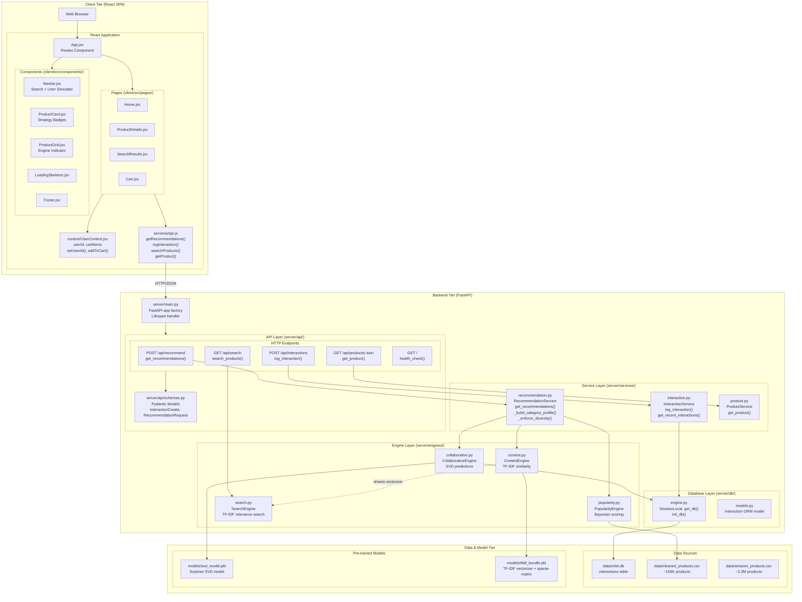
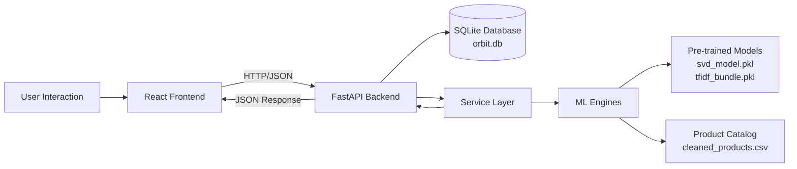
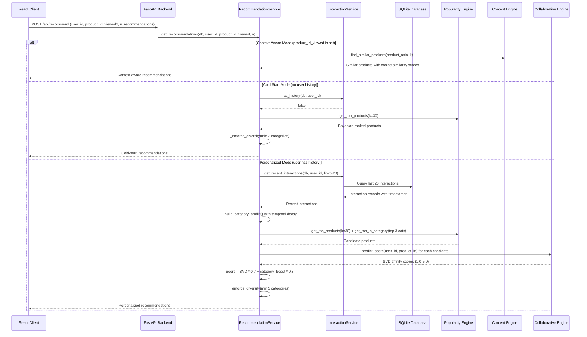
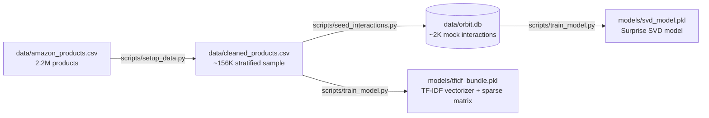
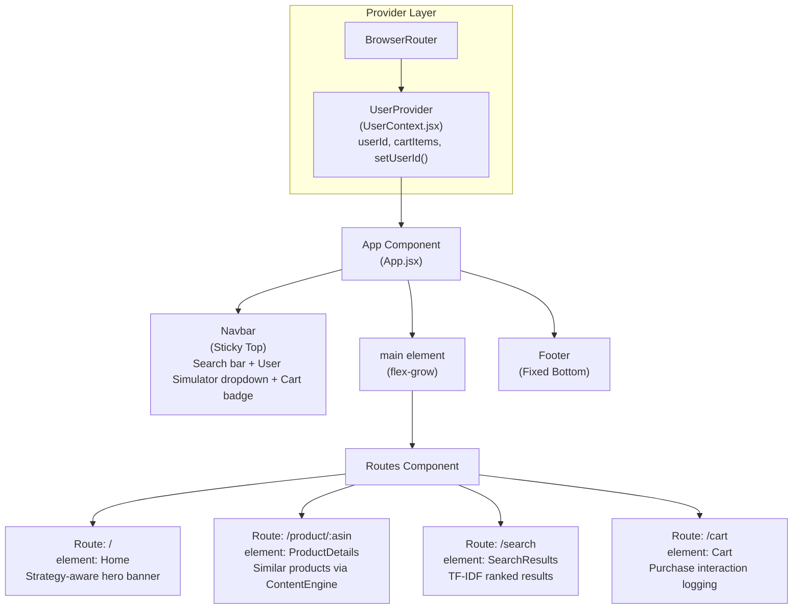

# ORBIT - Optimized Recommendation-Based Intelligent Tracking System

ORBIT is an **Optimized Recommendation-Based Intelligent Tracking system** that delivers personalized product recommendations using a hybrid approach combining SVD Collaborative Filtering, TF-IDF Content Similarity, Bayesian Popularity Ranking, and real-time user interaction tracking — all built on a train-once, load-from-disk architecture.

## System Architecture

ORBIT implements a **layered web application architecture** with strict separation of concerns:

| Layer | Technology | Purpose |
|-------|------------|---------|
| **Client Layer** | React, Vite, Tailwind CSS | User interface, user simulation, search, localStorage cart |
| **API Layer** | FastAPI, Pydantic, Uvicorn | Thin request routing, schema validation |
| **Service Layer** | Python classes | Orchestration logic, profile building, interaction logging |
| **Engine Layer** | scikit-learn, Surprise (SVD) | ML model inference (train-once, load from disk) |
| **Data Layer** | SQLAlchemy, SQLite, Pandas | Interaction persistence, product catalog |

### Architecture Overview



## Core Components

### 1. Recommendation Engines

#### PopularityEngine

Handles cold-start scenarios using a **Bayesian-averaged** weighted scoring formula:

```python
bayesian_stars = (R * v + C * m) / (v + m)    # Bayesian average (prevents low-vote outliers)

popularity_score = bayesian_stars * 2.0
                 + log(reviews + 1) * 0.5       # Log-scaled review volume
                 + log(boughtInLastMonth + 1) * 0.3   # Trending signal
                 + (2.0 if isBestSeller)
```

Where `C` = global mean star rating, `m` = minimum votes threshold (25), `R` = product rating, `v` = review count.

#### ContentEngine

Provides content-based filtering using **sparse TF-IDF vectorization** and cosine similarity on enriched product tags:
- Tags combine: `title + category + price_bucket + quality_bucket + bestseller_token`
- All operations on scipy sparse matrices — **no PyTorch needed** (~900MB RAM saved vs. old system)
- TF-IDF bundle is pre-built by `scripts/train_model.py` and loaded from disk on startup

#### CollaborativeEngine

Uses **SVD (Singular Value Decomposition)** via the Surprise library for collaborative filtering with key improvements:
- **Temporal decay**: interactions lose half their weight every 14 days (`exp(-0.693 * days / halflife)`)
- **Additive aggregation**: repeated views/clicks accumulate signal (old system used `.max()` which lost granularity)
- **[1.0, 5.0] normalization** for proper SVD training scale
- Model is trained once via `scripts/train_model.py` and loaded from disk — no runtime retraining

#### SearchEngine

Smart search using TF-IDF relevance scoring — replaces the old substring-matching approach:
- **Shares** the ContentEngine's TF-IDF vectorizer (no duplicate data in memory)
- Query is vectorized → cosine similarity against all products → hybrid ranking
- Score formula: `relevance * 0.7 + quality * 0.3`
- Minimum similarity threshold (0.02) filters out garbage results
- **Regex-safe**: no `str.contains()`, immune to special characters like `C++`, `(`, etc.

### 2. API Endpoints

The FastAPI backend exposes five endpoints through `server/api/routes.py`:

- **POST /api/recommend** — Generates personalized, context-aware, or cold-start recommendations
- **POST /api/interactions** — Logs user behavior (view, click, add_to_cart, purchase)
- **GET /api/search** — Executes TF-IDF relevance search queries
- **GET /api/products/{asin}** — Retrieves a single product by ASIN
- **GET /** — Health check endpoint

### 3. Recommendation Strategies

ORBIT uses **three recommendation strategies** selected automatically based on context:

1. **Cold Start Mode**: New user with no history → returns popularity-ranked products with diversity enforcement (min 3 categories)
2. **Personalized Mode**: User with history → builds decayed category profile from last 20 interactions, combines SVD scores with bounded category boost, enforces diversity
3. **Context-Aware Mode**: User viewing a specific product → returns TF-IDF content-similar products

**Key stability fix**: A single product view contributes ~1% to the recommendation score (was 33-75% in the old system due to flat +1.5 category boost).

## Data Flow and User Journeys

### Overall Data Flow



### Recommendation Request Flow



### Engine Initialization Flow (Server Startup)

```mermaid
graph LR
    Startup["uvicorn server.main:app"] --> InitDB["init_db()<br/>Create SQLite tables"]
    InitDB --> LoadPop["PopularityEngine()<br/>Load CSV + compute Bayesian scores"]
    LoadPop --> LoadCollab["CollaborativeEngine()<br/>Load SVD from models/svd_model.pkl"]
    LoadCollab --> LoadContent["ContentEngine()<br/>Load TF-IDF from models/tfidf_bundle.pkl"]
    LoadContent --> LoadSearch["SearchEngine(content_engine)<br/>Share TF-IDF + precompute quality"]
    LoadSearch --> WireServices["Wire up services<br/>RecommendationService<br/>InteractionService<br/>ProductService"]
    WireServices --> InjectRoutes["Inject services into API routes"]
    InjectRoutes --> Ready["Server Ready<br/>No training at startup"]
```



### Training Pipeline (One-time Setup)



## Key Features

- **Train-Once Architecture**: Models are trained offline and loaded from disk — no runtime retraining on every startup
- **Real-time Interaction Tracking**: Logs user behavior (view, click, add_to_cart, purchase) to SQLite for profile building
- **Hybrid Recommendation Strategy**: Combines SVD collaborative filtering, TF-IDF content similarity, and Bayesian popularity ranking
- **Temporal Decay**: Recent interactions matter more — half-life of 14 days prevents stale history from dominating
- **Diversity Enforcement**: At least 3 distinct categories in top-N results to prevent filter bubbles
- **Smart Search**: TF-IDF relevance scoring replaces naive substring matching — immune to regex injection
- **User Simulation Panel**: Switch between users in real-time from the navbar for testing/debugging
- **Model Caching**: Pre-computes and caches TF-IDF matrices and SVD models for instant startup

## Frontend Integration

The React application follows a component-based architecture with centralized state management via `UserContext`:



The frontend communicates with the backend via HTTP/JSON API calls through the `services/api.js` module. User state (userId + cart) is managed via React Context and persisted to `localStorage`.

## Setup & Running

### Prerequisites
- Python 3.10+ (with conda or venv)
- Node.js 18+ and npm
- The raw Amazon dataset (`data/amazon_products.csv`)

### Installation

```bash
git clone https://github.com/adityasahu1109/ORBIT-Optimized-Recommendation-Based-on-Intelligent-Tracking.git
cd ORBIT-Optimized-Recommendation-Based-on-Intelligent-Tracking

# Python dependencies
pip install -r requirements.txt

# Frontend dependencies
cd client && npm install && cd ..
```

### Running the Application

The server **automatically handles first-run setup**. If it detects missing data or models, it will:
1. Clean and sample from the raw 2.2M product CSV → ~156K products
2. Seed mock user interactions (100 users, ~2K interactions)
3. Train SVD + build TF-IDF bundle and save to `models/`

Just start the server — everything is handled:

```bash
# Terminal 1: Start the FastAPI backend (auto-setup on first run)
uvicorn server.main:app --reload

# Terminal 2: Start the React frontend
cd client && npm run dev
```

Open **http://localhost:5173** in your browser. Interactive API docs at **http://localhost:8000/docs**.

> **Note**: First startup takes 30-60 seconds for auto-setup. Subsequent starts load instantly from disk.

### Manual Scripts (Optional)

If you want to re-run individual steps manually:

```bash
python -m scripts.setup_data           # Re-clean + resample from raw CSV
python -m scripts.seed_interactions    # Regenerate mock interaction data
python -m scripts.train_model          # Retrain SVD + rebuild TF-IDF bundle
```

## Notes

- The system uses SQLite for persistence with SQLAlchemy ORM — database stored at `data/orbit.db`
- Product catalog is stored in `data/cleaned_products.csv` (~156K stratified sample from 2.2M raw products)
- Pre-trained models are cached in the `models/` directory — only re-run `scripts/train_model.py` to refresh
- First-run auto-setup detects missing files and runs the full pipeline automatically
- CORS is configured for development with React on localhost:5173
- The SearchEngine shares the ContentEngine's TF-IDF vectorizer to avoid duplicate data in memory
- The system supports cold-start, personalized, and context-aware recommendation modes
- Category boosting is proportional to decayed profile weight — a single view contributes ~1% (not a flat +1.5)
- All configuration (hyperparameters, paths, weights) lives in `server/config.py` as a single source of truth

