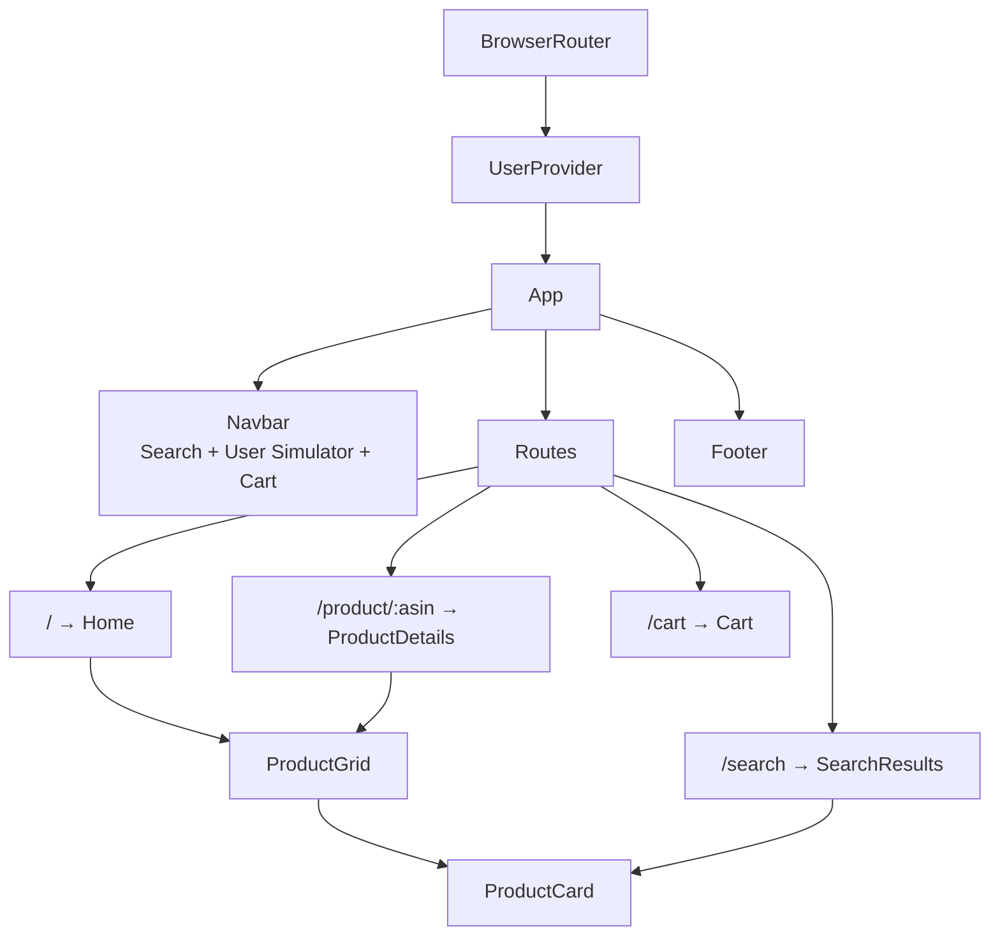
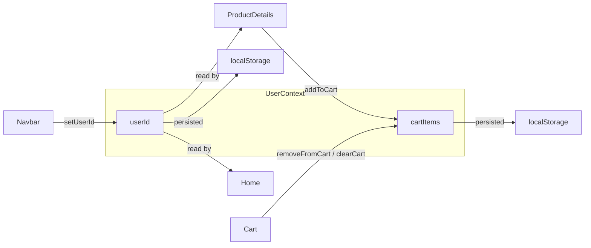
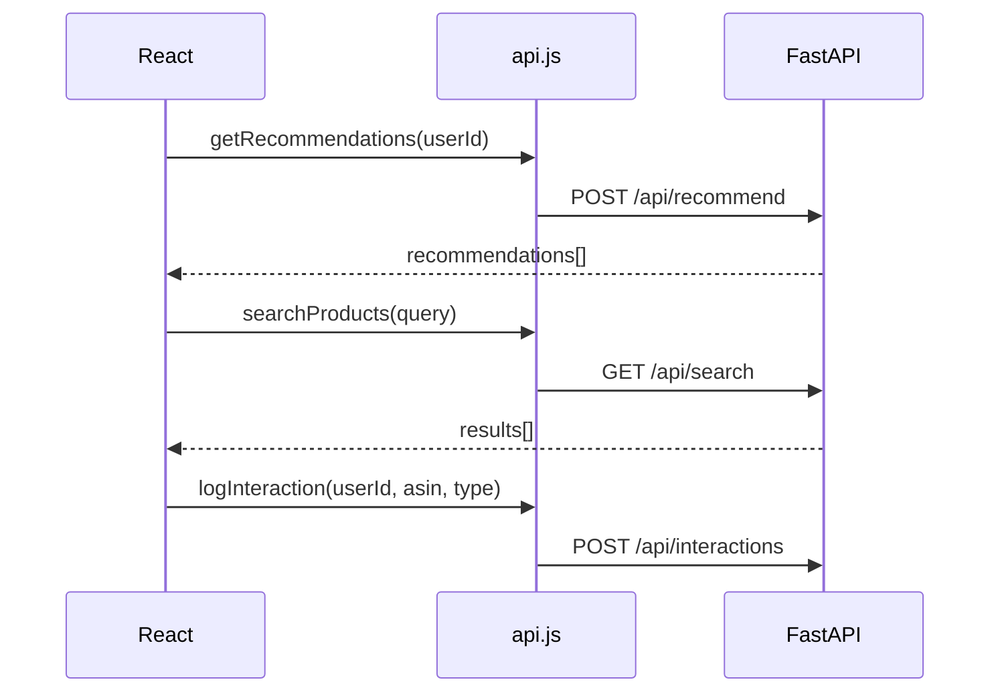

# ORBIT Frontend — React + Vite + Tailwind CSS

The `client/` directory contains the React SPA for ORBIT. It provides product browsing, search, a shopping cart, and a **User Simulation Panel** for testing recommendation strategies in real time.

---

## Tech Stack

| Technology | Version | Purpose |
|------------|---------|---------|
| React | 18.x | UI framework |
| Vite | 7.x | Dev server + bundler |
| Tailwind CSS | 4.x | Utility-first styling |
| React Router | 6.x | Client-side routing |
| Lucide React | — | Icons |

---

## Component Architecture



### State Flow



### API Integration



---

## Key Features

- **User Simulator**: Switch between users (1001–1100) or cold user (9999) from the navbar
- **Strategy Badges**: 🔥 Trending, ✨ For You, 🔗 Similar, 📈 Popular on each card
- **Cold Start UI**: Shows "Trending Products" banner when user has no history
- **Skeleton Loading**: Animated placeholders during API calls

---

## Running

```bash
cd client
npm install       # Install dependencies
npm run dev       # Dev server at http://localhost:5173
npm run build     # Production build to dist/
```

> The backend must be running on `http://127.0.0.1:8000` for API calls to work.
