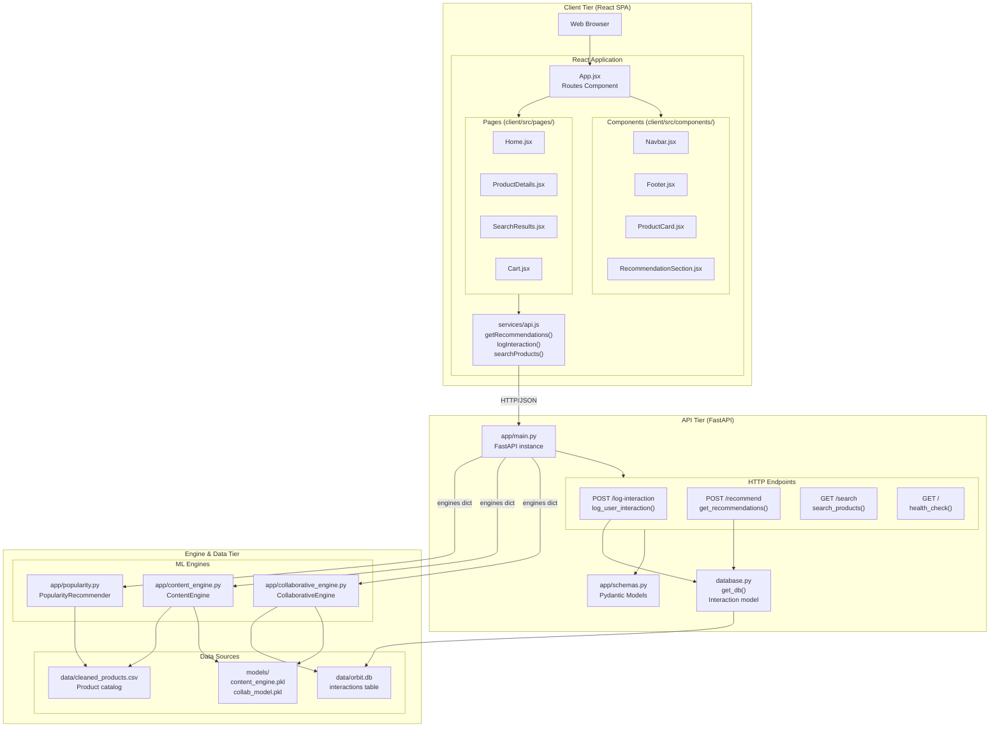
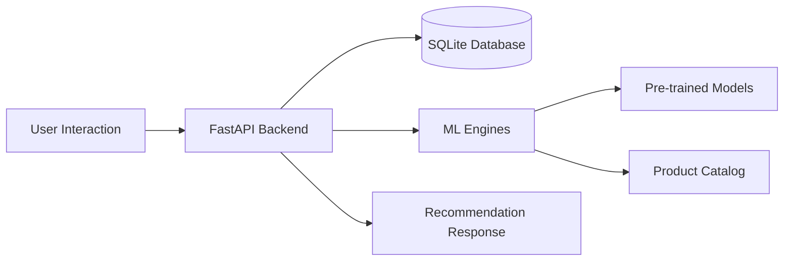
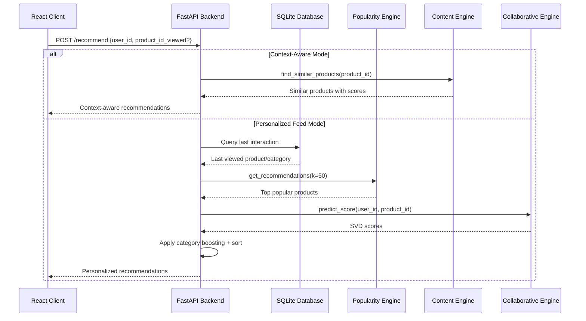
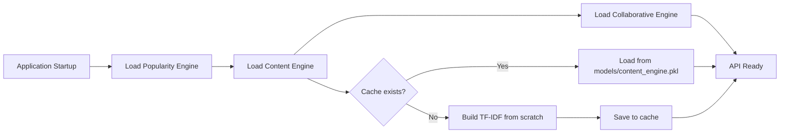
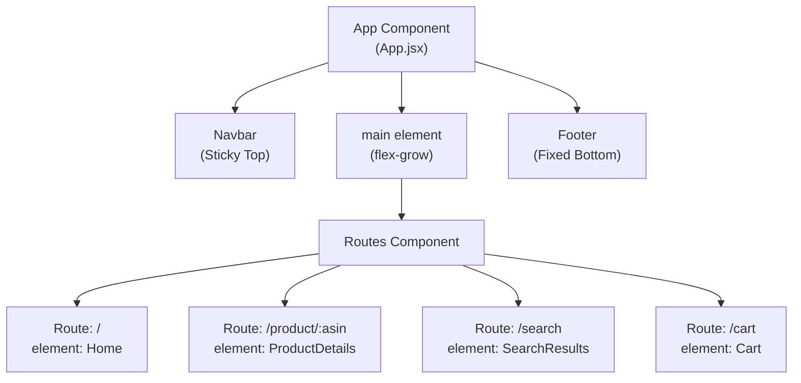

# ORBIT - Optimized Recommendation-Based Intelligent Tracking system

ORBIT is an **Optimized Recommendation-Based Intelligent Tracking system** that delivers personalized product recommendations using a hybrid approach combining multiple ML algorithms and real-time user interaction tracking.  

## System Architecture

ORBIT implements a **three-tier web application architecture** with clear separation of concerns:

| Tier | Technology | Purpose |
|------|------------|---------|
| **Client Layer** | React, Vite, Tailwind CSS | User interface, navigation, localStorage cart |
| **API Layer** | FastAPI, Pydantic, SQLAlchemy | Request validation, engine orchestration, interaction logging |
| **Engine/Data Layer** | Scikit-learn, PyTorch, SQLite | ML model inference, data persistence, product catalog |

### Architecture Overview



## Core Components

### 1. Recommendation Engines

#### PopularityRecommender

Handles cold-start scenarios using a weighted scoring formula:

```python
popularity_score = (stars × 2.0) + (log(reviews + 1) × 0.5) + (boughtInLastMonth × 0.01) + (isBestSeller × 2.0)
```

#### ContentEngine

Provides content-based filtering using TF-IDF vectorization and cosine similarity with GPU acceleration:

#### CollaborativeEngine

Uses SVD (Singular Value Decomposition) for collaborative filtering based on user interaction history.

### 2. API Endpoints

The FastAPI backend exposes four main endpoints:

- **POST /log-interaction** - Tracks user behavior (view, click, add_to_cart, purchase)
- **POST /recommend** - Generates personalized or context-aware recommendations
- **GET /search** - Executes product search queries
- **GET /** - Health check endpoint

### 3. Recommendation Strategies

ORBIT uses **context-aware recommendation logic** with two main scenarios:

1. **Context-Aware Mode**: When viewing a specific product, returns similar items using ContentEngine
2. **Personalized Feed Mode**: For homepage, combines popularity scores with collaborative filtering and category boosting

## Data Flow and User Journeys

### Overall Data Flow



### Recommendation Request Flow



### Engine Initialization Flow



## Key Features

- **Real-time Interaction Tracking**: Logs user behavior to improve recommendations
- **Hybrid Recommendation Strategy**: Combines multiple algorithms for optimal results
- **Category Boosting**: Enhances recommendations based on user's recent interests
- **GPU Acceleration**: Uses PyTorch for faster similarity computations
- **Model Caching**: Pre-computes and caches expensive operations for fast startup

## Frontend Integration

The React application structure follows a component-based architecture:



The frontend communicates with the backend via HTTP/JSON API calls through the `services/api.js` module.

## Notes

- The system uses SQLite for persistence with SQLAlchemy ORM
- Product catalog is stored in `data/cleaned_products.csv`
- Models are cached in the `models/` directory for fast initialization
- CORS is configured for development with React on localhost:5173
- The ContentEngine includes optimization to load pre-computed TF-IDF matrices from cache
- The system supports both context-aware and personalized recommendation modes
- Category boosting is applied based on user's last interaction to improve relevance
