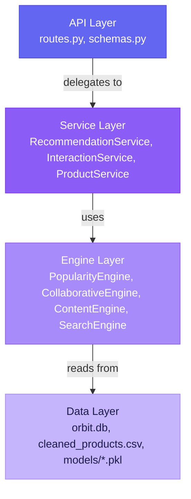
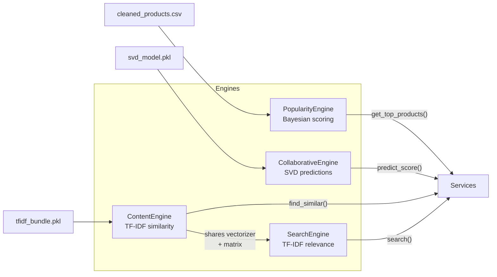
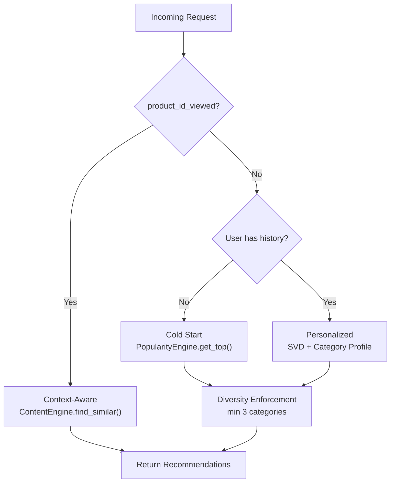
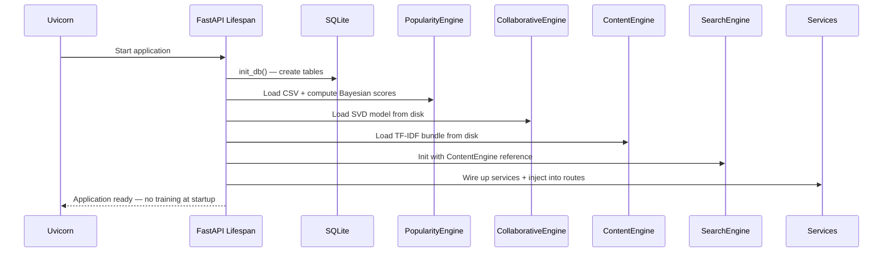

# ORBIT Backend — FastAPI + ML Engine Layer

The `server/` package contains the entire backend: API routing, service orchestration, ML engines, and database access. It follows a **layered architecture** where each layer only depends on the layer below it.

---

## Package Structure

```
server/
├── main.py                 # FastAPI app factory + lifespan handler
├── config.py               # Single source of truth for all settings
│
├── api/                    # Thin HTTP layer (no business logic)
│   ├── routes.py           # Route definitions → delegates to services
│   └── schemas.py          # Pydantic models for request/response
│
├── services/               # Business logic layer
│   ├── recommendation.py   # RecommendationService (orchestrator)
│   ├── interaction.py      # InteractionService (DB read/write)
│   └── product.py          # ProductService (catalog access)
│
├── engines/                # ML inference layer (stateless after init)
│   ├── base.py             # BaseEngine ABC
│   ├── popularity.py       # PopularityEngine (Bayesian scoring)
│   ├── collaborative.py    # CollaborativeEngine (SVD)
│   ├── content.py          # ContentEngine (TF-IDF similarity)
│   └── search.py           # SearchEngine (TF-IDF relevance search)
│
└── db/                     # Data access layer
    ├── engine.py           # SQLAlchemy engine, SessionLocal, init_db()
    └── models.py           # ORM models (Interaction table)
```

---

## Layer Dependencies



**Key rule**: Routes never call engines directly. Services never access the DB directly (they use the ORM models). Engines never depend on services.

---

## Engine Architecture



---

## Engine Details

### PopularityEngine (`engines/popularity.py`)
- Loads `cleaned_products.csv` into a DataFrame
- Computes Bayesian-averaged popularity scores on init
- Pre-sorts by score for O(1) top-K retrieval
- Exposes: `get_top_products(k)`, `get_top_in_category(cat, k)`, `get_product_info(asin)`

### CollaborativeEngine (`engines/collaborative.py`)
- Loads pre-trained SVD model from `models/svd_model.pkl`
- Predicts user-item affinity scores on a 1.0–5.0 scale
- Training logic lives here too (called from `scripts/train_model.py`), but the engine itself never trains at runtime
- Uses exponential temporal decay (half-life = 14 days) and additive aggregation

### ContentEngine (`engines/content.py`)
- Loads pre-built TF-IDF bundle from `models/tfidf_bundle.pkl`
- Sparse cosine similarity for "similar products" recommendations
- Enriched tags: `title + category + price_bucket + quality_bucket + bestseller`
- No PyTorch — all operations on scipy sparse matrices

### SearchEngine (`engines/search.py`)
- **Shares** the ContentEngine's TF-IDF vectorizer (no duplicate data)
- Vectorizes query → cosine similarity → hybrid ranking
- Score formula: `relevance × 0.7 + quality × 0.3`
- Minimum similarity threshold (0.02) filters garbage results

---

## Service Layer

### RecommendationService (`services/recommendation.py`)
The **brain** of ORBIT. Three strategies:



Key design decisions:
- Category profile built from last 20 interactions with temporal decay
- Category boost is proportional to profile weight (not a flat constant)
- A single view contributes ~1% to the profile (1/20 × decay)
- At least 3 categories enforced in top-N results

### InteractionService (`services/interaction.py`)
- `log_interaction(db, user_id, product_id, type)` — writes to SQLite
- `get_recent_interactions(db, user_id, limit=20)` — ordered by timestamp desc
- `has_history(db, user_id)` — quick cold-start check

### ProductService (`services/product.py`)
- Thin wrapper around PopularityEngine for catalog lookups

---

## API Endpoints

| Method | Path | Request Body / Params | Response |
|--------|------|----------------------|----------|
| `POST` | `/api/recommend` | `{user_id, product_id_viewed?, n_recommendations}` | `{user_id, strategy, recommendations[]}` |
| `POST` | `/api/interactions` | `{user_id, product_id, interaction_type}` | `{status, message}` |
| `GET` | `/api/search` | `?query=wireless+headphones` | `{query, results[]}` |
| `GET` | `/api/products/{asin}` | — | Product dict or 404 |
| `GET` | `/` | — | `{status, version}` |

---

## Startup Sequence



---

## Running the Backend

```bash
# From the project root directory:

# Start with auto-reload (development)
uvicorn server.main:app --reload

# Start on a specific port
uvicorn server.main:app --reload --port 8000

# Production (without reload)
uvicorn server.main:app --host 0.0.0.0 --port 8000
```

The server runs at `http://127.0.0.1:8000`. Interactive API docs at `/docs`.

---

## Configuration

All settings are in [`config.py`](config.py). Key parameters:

| Parameter | Default | Description |
|-----------|---------|-------------|
| `DECAY_HALFLIFE_DAYS` | 14 | How quickly old interactions lose weight |
| `USER_HISTORY_LIMIT` | 20 | Max recent interactions for profile building |
| `SVD_WEIGHT` | 0.7 | SVD score weight in the hybrid formula |
| `CATEGORY_BOOST_WEIGHT` | 0.3 | Category boost weight in the hybrid formula |
| `TFIDF_MAX_FEATURES` | 5000 | TF-IDF vocabulary size |
| `SEARCH_MIN_SIMILARITY` | 0.02 | Minimum cosine similarity for search results |
